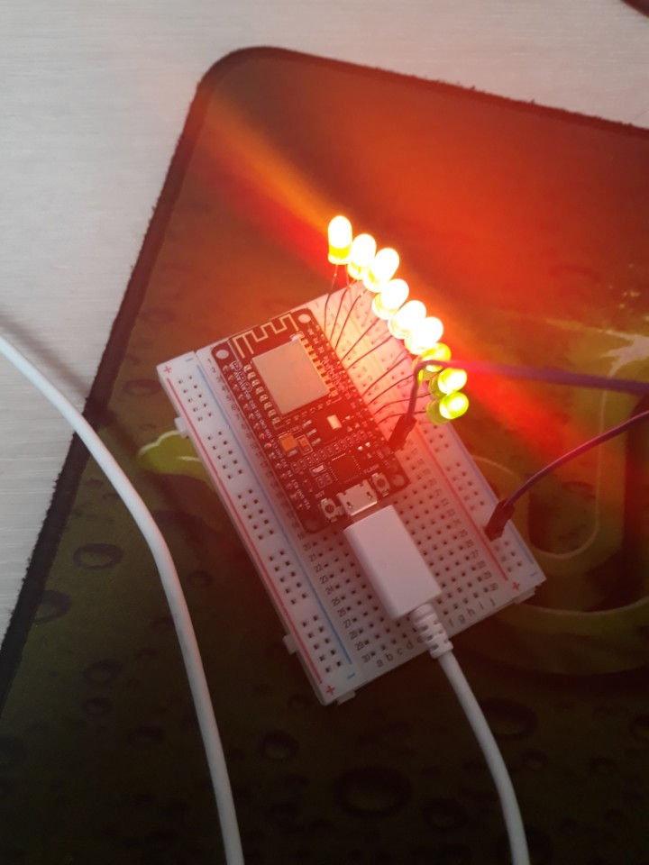
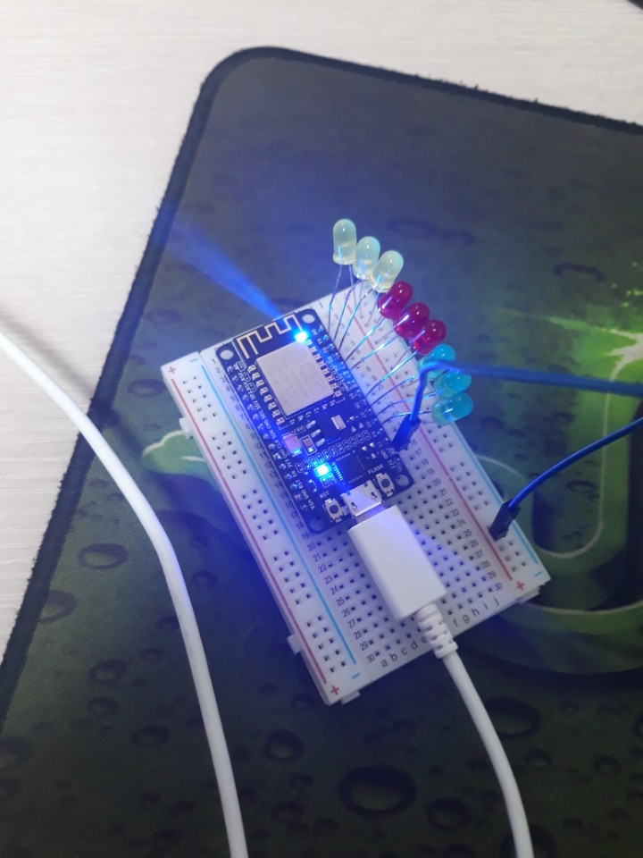

Digital LED Media Art
=====================

여기에선 NodeMCU와 LED를 BreadBoard를 통해서 연결함으로서 점멸시켜보는 연습이다.  
원래 LED를 '+' 전원에 바로 연결하면 터져버리지만, NodeMCU는 괜찮다.

  
### Example1 - 불을 동시에 점멸 ###
9개의 LED를 연결시킨 뒤 모두 동시에 켰다가 동시에 끄는 연습

### Example2 - 불을 하나씩 켰다가 끄기 ###
D0에서부터 D8까지 켜졌다가 D0에서부터 D8까지 꺼지는 연습

### Example3 - 불을 더 빨리 점멸 ###
Example2와 동일하지만 더 빠르게 점멸하도록 하는 연습

### Example4 - 불을 줄이 늘어났다가 줄어드는 것처럼 점멸시키기 ###
D0에서부터 D8까지 켜졌다가 D8에서부터 D0까지 꺼지는 연습

### Example5 - 불을 줄이 점점 늘어났다가 점점 줄어드는 것처럼 점멸시키기 ###
D0에서부터 D8까지 점점 빨라지면서 켜졌다가 D8에서부터 D0까지 점점 느려지면서 꺼지는 연습

### Example6 - 불을 공이 튀는 것처럼 점멸시키기 ###
하나씩 차례대로 켜졌다 꺼지게 하기

### When it is ON ###

### When it is OFF ###

